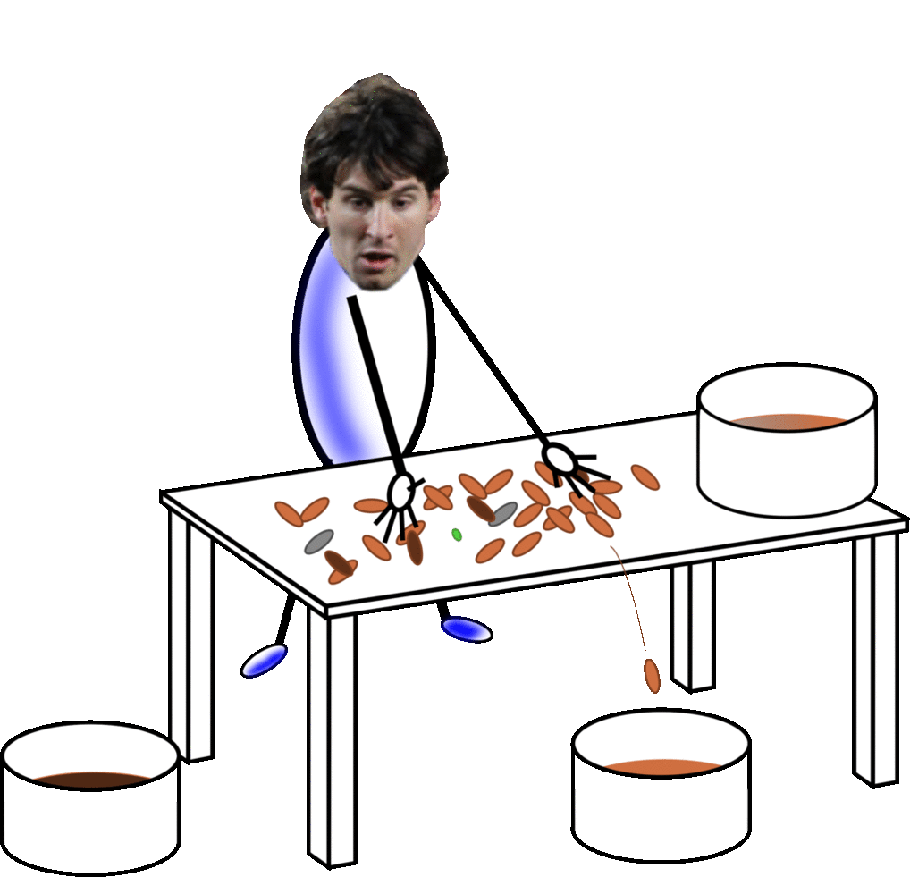

# Shared stuff / Cosas compartidas

## Por qué

Sirva este lugar para guardar cosas que algún día pueda querer compartir, o que quiera volver a ver yo mismo,
plagiándome. De paso, las hace descubribles. Hasta ahora, cuando he querido compartir algo, he tenido que buscar en
diversos lugares (disco muy desordenado, GDrive, GitHub, GitLab, mail...) y luego ver de qué forma lo envío. Habla mal
de mis políticas de organización y respaldo, pero así están las cosas. Mientras tanto, sirva esto para tener algo, y
como un medio más de respaldo. Y sirva de _portfolio_.

## Listado

### /bvib

#### [bvib/aguadopd-bvib-2017.pdf](bvib/aguadopd-bvib-2017.pdf)

Informe de mi trabajo durante las Becas de Verano 2017 del Instituto Balseiro.

**Modelado de un fantoma antropomórfico virtual para su uso médico mediante métodos de Monte Carlo**

> En este trabajo se verificó el uso de algoritmos tipo Monte Carlo usando EGSnrc) para la simulación de dosis de
> radiación absorbida por un fantoma de tórax CIRS 002LFC IMRT. Para ello se construyó un modelo virtual del fantoma, a
> partir de datos de tomografía computada y utilizando el programa ctcreate. Se simuló la incidencia de haces simples de
> fotones y también de un conjunto de haces con la técnica 4FBT. Los resultados se compararon con cálculos de dosis
> realizados en el sistema comercial de planificación de tratamiento MIRS, en las mismas condiciones de irradiación. Se
> observó una buena correspondencia entre los perfiles de dosis y curvas de isodosis para ambos métodos de cálculo,
> considerando sus limitaciones.

### /gerunsj

El [GERUNSJ](https://github.com/GERUNSJ/deteccion-de-personas-con-turtlebot-y-opencv-1) es el [Grupo Estudiantil de Robótica de la Universidad Nacional de San Juan](http://www.facebook.com/GERUNSJ), un espacio extracurricular en el que alumnos de la UNSJ idean
y llevan a cabo proyectos relacionados con la robótica, la electrónica y materias afines. En él intentamos aplicar los
conocimientos aprendidos y expresar nuestra creatividad más allá de lo que las actividades curriculares nos exigen.

#### [gerunsj/aguadopd-gerunsj-quienesfuimos-2016.pdf](gerunsj/aguadopd-gerunsj-quienesfuimos-2016.pdf)
Documento que usábamos para presentarnos. Resumen de quienes éramos en ese entonces, qué hacíamos y qué pretendíamos.

#### [gerunsj/drsj2014/aguadopd-gerunsj-drsj-2014.pdf](gerunsj/drsj2014/aguadopd-gerunsj-drsj-2014.pdf)
Informe del I Desafío de Robótica San Juan.

#### [gerunsj/drsj2015/aguadopd-gerunsj-drsj-2015.pdf](gerunsj/drsj2015/aguadopd-gerunsj-drsj-2015.pdf)
Informe del II Desafío de Robótica San Juan.

### /iaeste-karunya

Informe y presentación sobre el trabajo de investigación que hice en la Universidad de Karunya durante mi pasantía como
becario de IAESTE. _Compartido con permiso_.

**Face Recognition for Automatic Class Attendance System --- Reconocimiento Facial para un Sistema Automático de Control
de Asistencia a Clases**

#### [iaeste-karunya/aguadopd-iaeste-karunya-report-2015.pdf](iaeste-karunya/aguadopd-iaeste-karunya-report-2015.pdf)
#### [iaeste-karunya/aguadopd-iaeste-karunya-report-presentation-2015.pdf](iaeste-karunya/aguadopd-iaeste-karunya-report-presentation-2015.pdf)

### /unsj

Informes y algunas cosas complejas que hice durante mis estudios de Ingeniería Electrónica en la UNSJ.

#### [unsj/sonido/aguadopd-unsj-sonido-ti-2016.pdf](unsj/sonido/aguadopd-unsj-sonido-ti-2016.pdf)
Trabajo integrador de la materia Acústica y sistemas de sonido.

> En este trabajo se presenta un sistema para la evaluación sistemática de algoritmos de reconocimiento de vocales. Se
> presentan dos algoritmos habituales para la extracción de formantes y se evalúan con el sistema elaborado, sobre una
> pequeña base de datos de vocales.

Fuentes en https://github.com/aguadopd/avi_evaluacion_reconocimiento_formantes .

#### [unsj/teleco1/aguadopd-unsj-teleco1-resumen-2015.pdf](unsj/teleco1/aguadopd-unsj-teleco1-resumen-2015.pdf)
Resumen para rendir Telecomunicaciones 1.

#### [unsj/teleco2/aguadopd-unsj-teleco2-pi-2015.pdf](unsj/teleco2/aguadopd-unsj-teleco2-pi-2015.pdf)
Informe del proyecto integrador de Telecomunicaciones 2: **Recepción de imágenes de satélites meteorológicos a través
del sistema APT**.

#### unsj/tfinal/

Cosas de mi trabajo final de graduación **Una estrategia para la clasificación óptica de almendras**.

> En este trabajo se diseñó y desarrolló un programa informático para la clasificación automática de almendras peladas
> mediante procesamiento de imágenes, analizando diversas características de forma y de color. Para ensayarlo se
> construyó un prototipo de sistema de visión artificial con el cual se creó un conjunto de 564 imágenes de almendras y
> otros objetos. El conjunto de imágenes fue etiquetado manualmente en base a las normas de la Comisión Económica de las
> Naciones Unidas para Europa (UNECE) para el comercio de almendras. Los resultados del clasificador desarrollado son
> similares a los obtenidos con algoritmos de clasificación estándar, como máquinas de soporte vectorial o _Boosted
> Trees_. Los descriptores elegidos permiten clasificar binariamente el conjunto con una exactitud global de 93 %.

- [unsj/tfinal/aguadopd-unsj-tfinal-2017.pdf](unsj/tfinal/aguadopd-unsj-tfinal-2017.pdf)
- [unsj/tfinal/aguadopd-unsj-tfinal-presentacion-2017.pdf](unsj/tfinal/aguadopd-unsj-tfinal-presentacion-2017.pdf)

#### [unsj/vision/aguadopd-unsj-vision-ti-2016.pdf](unsj/vision/aguadopd-unsj-vision-ti-2016.pdf)
Informe del trabajo integrador para la materia Visión Artificial.

> Se planteó como objetivo principal del proyecto realizar la detección de personas desde un robot móvil con un grado
> aceptable de aciertos. Para ello se probaron la eficiencia y eficacia de distintos algoritmos que fueron implementados
> en OpenCV sobre un robot TurtleBot, equipado con una cámara RGB+D Microsoft Kinect y trabajando bajo el sistema ROS
> (Robot Operative System). El programa desarrollado fue luego adaptado para poder utilizarse en otras cámaras sin
> información de profundidad, como una webcam de una PC o una minicomputadora Raspberry Pi 2 con cámara. El informe se
> extiende sobre algunas alternativas de trabajo, conceptos de los detectores utilizados y también sobre ROS, ya que fue
> una herramienta de uso constante. Se abordan también las pruebas realizadas, su evaluación e interpretación,
> terminando con algunas conclusiones obtenidas y posibles mejoras.

Fuentes en https://github.com/GERUNSJ/deteccion-de-personas-con-turtlebot-y-opencv-1 .

#### ToDo

- Identificación y Control Adaptable

### /vinci

En el Instituto Vinci enseñamos tecnologías, emprendimiento y conciencia social, por medio del aprendizaje basado en
proyectos. La iteración al momento de escribir esto [se llama](https://www.instagram.com/vinciu_/) [VinciU](https://vinciu.com/).

#### [vinci/aguadopd-vinci-intro-videos-2018.mp4](vinci/aguadopd-vinci-intro-videos-2018.mp4)
Intro para algunos videos que creamos. Yo no hice la animación.

#### [vinci/aguadopd-vinci-publicidad-youtube-1-shooting-2018.mp4](vinci/aguadopd-vinci-publicidad-youtube-1-shooting-2018.mp4)
Corto publicitario apuntado a los chicos. Obra maestra.

#### ToDo
- Tutoriales impresión
- Webs cursos?

## Para el Pablo del futuro

- Pensar bien la estructura y mantenerlo simple porque después no vamos a poder cambiar los nombres.

-----------------

